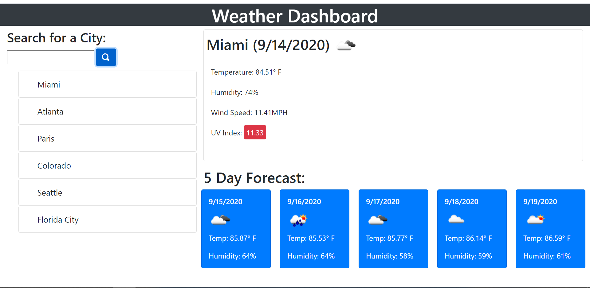

# Weather Dashboard

## Description

A fully dynamic weather webpage programmed with javascript with information provided by openweathermap.org 's useful weather api's to bring the user forecasts on which ever city they choose.

## Technologies used:

* Javascript
* HTML
* CSS
* JQuery
* Openweathermap API
* Bootstrap 

  

https://jespi116.github.io/weather-dashboard/

## Questions:

If you have any questions about the repo, open an issue or contact me directly at Jespi116@fiu.edu. you can find more of my work at [Jespi116](https://github.com/Jespi116)
